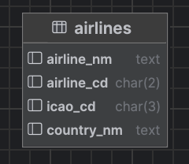
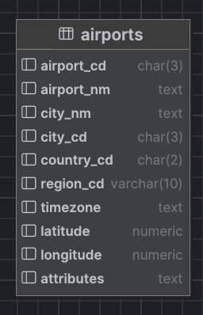
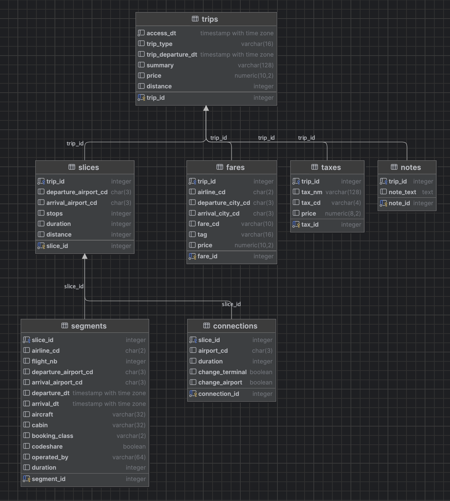
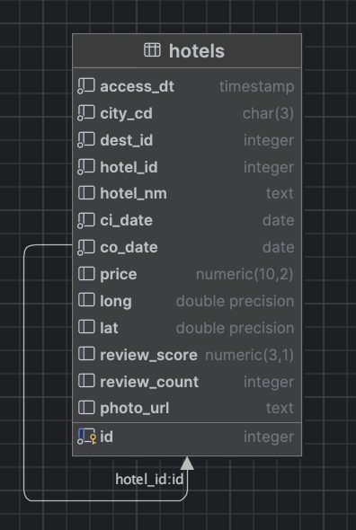

# Data Extraction Module for QuickEscape

## About

This module is created to extract, process, and organize city, flight, and accommodation data from various sources such as `Booking.com` and `ITA Matrix` to provide the user with the best travel options.

Automated data extraction is performed using `requests`, `Selenium`, and `BeautifulSoup` to scrape data from the web. The extracted data is then processed and stored in a `postgresql` database for further use.

**Author**: Yichi "Jeremy" Zhang

**Email**: jeremy.zhang@emory.edu

**Last Updated**: Dec 4 2024

## Deploy

### System Requirements

1. `Python` 3.12 or higher with required packages
2. `MacOS` or `Linux`
3. `Chrome for Testing` and `ChromeDriver`
4. `X11` and `Xvfb` (if running on a headless server)
5. `cron` or `systemd` services for scheduling
6. `postgresql` database
7. Internet Connection

### Installation

#### Operating System

The program is tested on `MacOS Sonoma` and `Ubuntu 24.04` but has not been tested on `Windows`. It should work on other Linux distributions as well.

The program requires support for visual interfaces such as `X11` to correctly render the web pages. 
If you are using a headless server, you may need to install `X11` and `Xvfb` via package management system to run the program.

Also, to schedule the program to run at specific times, you may use `cron` or `systemd` services. 
In this document, only examples of scheduling using `cron` are provided.

#### `Python`

You may install `Python` from the [official website](https://www.python.org/downloads/).

Once installed, you may install the required packages using the following command:

```bash
pip install -r requirements.txt
```

#### `Chrome for Testing` and `ChromeDriver`

You may download `Chrome for Testing` and `ChromeDriver` from [Google Chrome Labs](https://googlechromelabs.github.io/chrome-for-testing/) and set them up manually.

Or you may use the `DriverManager` package provided by `Selenium` to automatically download and set up the `ChromeDriver` for you.


#### `X11` and `Xvfb`

You may install `X11` and `Xvfb` using the package management system of your operating system.


#### `postgresql` Database

You may install `postgresql` using the package management system of your operating system and make sure it is running and accessible.
Edit configurations in the `.env` file to provide the database connection information.


### Configuration

1. `.env` file: Config file containing database connection information and API keys.
2. `run.sh` file: Bash script to automate the program execution. You may need to modify the path to the `Python` executable, the number of workers, and the path to save the log files.
3. `cron` job: Schedule the `run.sh` file to run at specific times. 
4. `job.py`: Generates jobs to scrape. You may need to modify the `job.py` file to change the destinations, dates, currency, and other parameters.


## Usage

### Processing Data

```bash
python data/city/airlines.py
python data/city/airports.py
python data/city/booking_com_dest.py
```

### Running the Scraper (Manually)

```bash
bash data/accomodation/run.sh
bash data/flight/run.sh
```

**Note**: Edits to configuration files may be required to run the program. It is recommended to use `cron` to schedule the program to run at specific times.

### Scheduling the Scraper

You may use `cron` to schedule the program to run at specific times. 

```bash
crontab -e
```

Here is an example to run the flight scraper daily and the accommodation scraper every other day. 
    
```bash
0 0 * * * /path/to/flight/run.sh
0 0 */2 * * /path/to/accomodation/run.sh
```
   

### Initializing the Database

```bash
python data/db/city.py
python data/db/flight.py
python data/db/accomodation.py
```

**Note**: This action will remove all existing data in the database and reinitialize it. **Use with caution.**

## Technical Details

### City 

#### Airlines

The raw data is manually collected from Kaggle and stored in the `data/city/data_raw/airlines.csv` file. 
The data is then cleaned, aggregated (`data/city/airlines.py`) using `pandas`, and stored in the `postgresql` database (`data/db/city.py`) in the following relational structure:



#### Airports

The raw data is manually collected from `ourairports.com` and `github.com` and stored in the `data/city/data_raw/airports.csv` file.
The data is then cleaned, aggregated (`data/city/airports.py`) using `pandas`, and stored in the `postgresql` database (`data/db/city.py`) in the following relational structure:



#### Booking.com Destinations

We use `requests` to scrape a third-party `Booking.com` API to get destination IDs of cities that are on our list (`data/city/booking_com_dest.py`) and saved as a csv file (`data/data_processed/booking_com_dest.csv`).

Once we have the destination IDs, we can use them to collect accommodation data from `Booking.com` API.

### Flight

The `run.sh` bash script automates the process of scraping flight data from `ITA Matrix` and storing it in the `postgresql` database.
The job scheduler (`data/flight/job.py`) generates jobs to scrape flight data for each destination (`data/data_processed/airports.csv`) and date.
Currently, we only scrape for trips from `ATL` to North American major cities on our destination list that departs within 100 days from the current date excluding the current date and the next day.
For those trips, we scrape one-way flights with a maximum of 1 stop in economy class using currency `USD`. 
However, this can be easily modified by changing the parameters in the `job.py` file.

The jobs are passed on to the scraper (`data/flight/ita_matrix_scraper.py`) to scrape the data from the `ITA Matrix` website.
The scraper first uses `Selenium` to open a controlled browser and navigate to the `ITA Matrix` website.
Then the scraper makes a dummy search to create a session and extract the session ID.
Once the session ID is obtained, the scraper builds URLs for each job and accesses the URLs.
While accessing the URLs, the scraper would wait until the overall structure of the page is loaded and then iteratively clicking on each itinerary. 
This would create network requests and responses that the scraper would capture and parse to extract flight data. 

Once network activities are captured, the scraper parses and cleans the data into a pre-defined relational structure 
that goes from `trips` to `flights` to `segments` along with a few other parameters such as `connections`, `fares`, `taxes`, and `notes`. 
The structured data is then uploaded to the `postgresql` database (`data/db/flight.py`) in the following relational structure:



When the jobs are executed, the job scheduler (`data/flight/job.py`) cleans up outdated data in the database, 
handles exceptions (such as outdated session ID, failed browser connection, access overtime, failed database action & etc.), and retries the job if the scraper fails the job.
When the jobs are completed, the job scheduler would also save a copy of the results in JSON format. 

### Accommodation

The `run.sh` bash script automates the process of scraping accommodation data from `Booking.com` and storing it in the `postgresql` database.
The job scheduler (`data/accomodation/job.py`) generates jobs to scrape accommodation data for each destination and date by reading processed destination data (`data/data_processed/booking_com_dest.csv`).
The jobs are passed on to the scraper (`data/accomodation/booking_com_scraper.py`) to scrape the data from a third-party API for `Booking.com` accommodation data.
Once the data is scraped, it is cleaned and uploaded to the `postgresql` database (`data/db/accomodation.py`) in the following relational structure:



## Future Work

1. Add support for rental cars 
   - Currently not implemented due to complex pricing of rental cars and limited computational resources
2. Add support for more departure cities and destinations
   - Currently, we only cache for trips from ATL to North American major cities due to limited computational resources
3. Add support for more accommodation providers
   - Currently, we only cache for `Booking.com`

## License

[MIT](https://choosealicense.com/licenses/mit/)